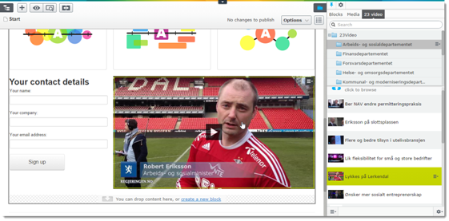

# 23 Video plugin for EPiServer 7.5 or later

## About

TBA

## Installation

TBA

## Copyright and License

The plugin is copyright 2014 Norwegian Government Security and Service Organisation. 

A license will be posted soon, in the meantime please [post an issue]( Issues 0) if you have any question.

## DISCLAIMER

THIS SOFTWARE  IS PROVIDED "AS IS" AND ANY EXPRESSED OR IMPLIED WARRANTIES, INCLUDING, BUT NOT LIMITED TO, THE IMPLIED WARRANTIES OF MERCHANTABILITY AND FITNESS FOR A PARTICULAR PURPOSE ARE DISCLAIMED. IN NO EVENT SHALL THE NORWEGIAN GOVERNMENT SECURITY AND SERVICE ORGANISATION , OR ANY OF THEIR CONTRIBUTORS BE LIABLE FOR ANY DIRECT, INDIRECT, INCIDENTAL, SPECIAL, EXEMPLARY, OR CONSEQUENTIAL DAMAGES (INCLUDING, BUT NOT LIMITED TO, PROCUREMENT OF SUBSTITUTE GOODS OR SERVICES; LOSS OF USE, DATA, OR PROFITS; OR BUSINESS INTERRUPTION) HOWEVER CAUSED AND ON ANY THEORY OF LIABILITY, WHETHER IN CONTRACT, STRICT LIABILITY, OR TORT (INCLUDING NEGLIGENCE OR OTHERWISE) ARISING IN ANY WAY OUT OF THE USE OF THIS SOFTWARE, EVEN IF ADVISED OF THE POSSIBILITY OF SUCH DAMAGE.

Without limiting the foregoing, the Norwegian Government Security and Service Organisation make no warranty that:

* the software will meet your requirements.
* the software will be uninterrupted, timely, secure or error-free.
* the results that may be obtained from the use of the software will be effective, accurate or reliable.
* the quality of the software will meet your expectations.
* any errors in the software obtained from the OpenSHA.org web site will be corrected.

Software and its documentation made available:

* could include technical or other mistakes, inaccuracies or typographical errors. The Norwegian Government Security and Service Organisation and its contributors may make changes to the software or documentation made available on its web site.
* may be out of date and the Norwegian Government Security and Service Organisation  and its contributors make no commitment to update such materials.

The Norwegian Government Security and Service Organisation  and its contributors assume no responsibility for errors or ommissions in the software or documentation available.

In no event shall the Norwegian Government Security and Service Organisation  and it's contributors be liable to you or any third parties for any special, punitive, incidental, indirect or consequential damages of any kind, or any damages whatsoever, including, without limitation, those resulting from loss of use, data or profits, whether or not the Norwegian Government Security and Service Organisation  and its contributors has been advised of the possibility of such damages, and on any theory of liability, arising out of or in connection with the use of this software.

The use of the software is done at your own discretion and risk and with agreement that you will be solely responsible for any damage to your computer system or loss of data that results from such activities. No advice or information, whether oral or written, obtained by you from the Norwegian Government Security and Service Organisation , its its website or its contributors shall create any warranty for the software.